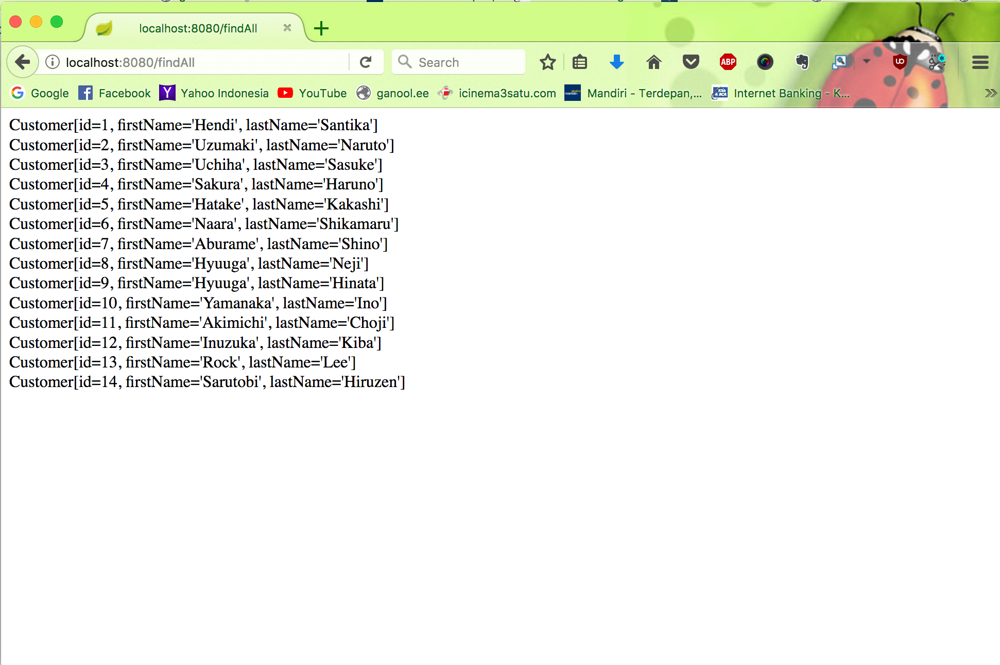
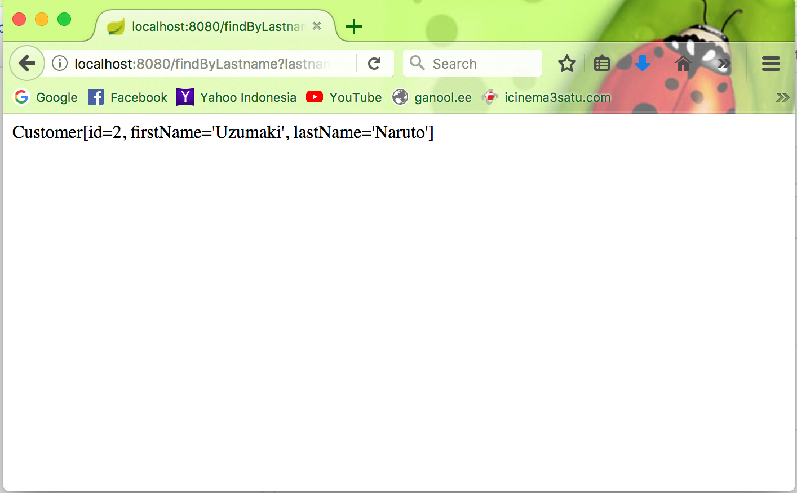

# Spring JPA PostgreSQL

# To Do things :

1. Run the project --> `mvn clean spring-boot:run`

2. Home Index --> `http://localhost:8080/`

    

3. Save the data first initialization --> `http://localhost:8080/save`

    

4. Find All the datas --> `http://localhost:8080/findAll`

    

5. Find By Id --> `http://localhost:8080/findById?id=1`

    

6. Find By Lastname --> `http://localhost:8080/findByLastname?lastname=Naruto`
    

