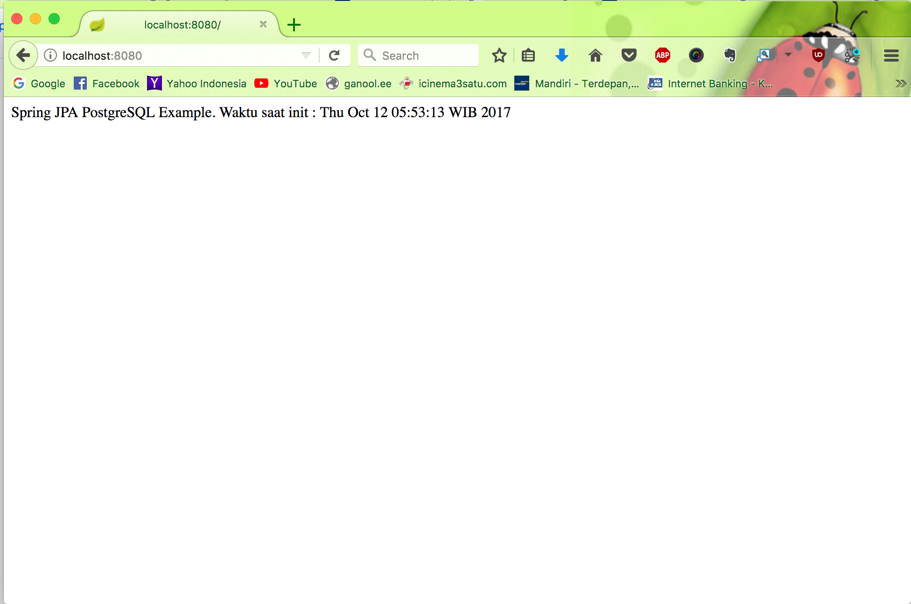

# Spring Boot JPA PostgreSQL Demo

A demonstration project showcasing Spring Boot 3.x integration with PostgreSQL database using Spring Data JPA, featuring
CRUD operations and RESTful endpoints.

## Tech Stack

- **Java**: 21
- **Spring Boot**: 3.3.2
- **Spring Data JPA**: For database operations
- **PostgreSQL**: Relational database
- **Lombok**: Reduces boilerplate code
- **Testcontainers**: For integration testing with PostgreSQL
- **Maven**: Build and dependency management

## Prerequisites

- Java 21 (Amazon Corretto or Temurin distribution recommended)
- PostgreSQL database (or use Testcontainers for testing)
- Maven 3.9+ (or use the included Maven Wrapper)

### Setting up Java 21

If you're using SDKMAN:

```bash
sdk install java 21.0.8-amzn
sdk use java 21.0.8-amzn
```

The project includes a `.sdkmanrc` file that will automatically set the correct Java version when you enter the
directory (if you have `sdkman_auto_env=true` in your SDKMAN config).

## Database Configuration

The application expects a PostgreSQL database with the following default configuration:

```properties
URL=jdbc:postgresql://localhost/postgres
Username=postgres
Password=test
```

You can modify these settings in `src/main/resources/application.properties`.

## Building the Project

Using Maven Wrapper (recommended):

```bash
./mvnw clean install
```

Or using your local Maven installation with Java 21:

```bash
JAVA_HOME=/path/to/java-21 mvn clean install
```

## Running the Application

Using Maven Wrapper:

```bash
./mvnw spring-boot:run
```

Or using Maven:

```bash
JAVA_HOME=/path/to/java-21 mvn spring-boot:run
```

The application will start on `http://localhost:8080`.

## Running Tests

The project uses Testcontainers for integration tests, so you don't need a running PostgreSQL instance:

```bash
./mvnw test
```

## API Endpoints

### 1. Home Index

**GET** `http://localhost:8080/`

Returns a welcome message with the current timestamp.



### 2. Save Sample Data

**GET** `http://localhost:8080/save`

Initializes the database with sample customer data (Naruto characters).


### 3. Find All Customers

**GET** `http://localhost:8080/findAll`

Returns all customers in the database.


### 4. Find Customer By ID

**GET** `http://localhost:8080/findById?id=1`

Returns a specific customer by their ID.


### 5. Find Customers By Last Name

**GET** `http://localhost:8080/findByLastname?lastname=Naruto`

Returns all customers matching the specified last name.


## Project Structure

```
src/
├── main/
│   ├── java/com/springjpa/
│   │   ├── SpringJpaPostgreSqlApplication.java  # Main application class
│   │   ├── controller/
│   │   │   └── WebController.java               # REST endpoints
│   │   ├── model/
│   │   │   └── Customer.java                    # JPA Entity
│   │   └── repo/
│   │       └── CustomerRepository.java          # Spring Data JPA Repository
│   └── resources/
│       └── application.properties               # Application configuration
└── test/
    └── java/com/springjpa/
        └── SpringJpaPostgreSqlApplicationTests.java  # Test configuration
```

## Important Notes

### Java Version Compatibility

This project requires **Java 21**. If you encounter compilation errors like "java.lang.ExceptionInInitializerError:
com.sun.tools.javac.code.TypeTag", it means you're using an incompatible Java version (e.g., Java 25). Please ensure
you're using Java 21.

### Lombok Configuration

The project uses Lombok 1.18.30 for better Java 21 compatibility. The `maven-compiler-plugin` is configured to process
Lombok annotations correctly.

## CI/CD

The project includes GitHub Actions workflow (`.github/workflows/maven.yml`) that:

- Builds the project on every push/PR to master
- Uses Java 21
- Integrates with Testcontainers Cloud for running tests
- Updates the dependency graph for Dependabot

## Contributing

Feel free to submit issues and pull requests.

## Author

- **Name**: Hendi Santika
- **Email**: hendisantika@gmail.com
- **Telegram**: @hendisantika34

## License

This project is a demonstration/learning project.
